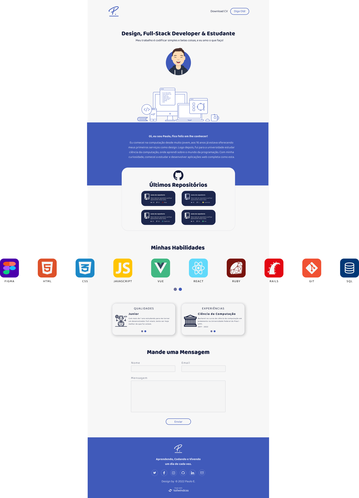

# 🚀 [Pumba Dev Website](https://pumbadev.com)

<h2 align="center">☕ Projeto Em Desenvolvimento</h2>

 

> Esta é minha web page pessoal, nela conterá informações profissionais e de contato. Com o desenvolvimento dessa aplicação irei praticar os conceitos de UI/UX design, Front-End Developer com Vue + Tailwind e criação de API RestFul com Ruby on Rails. [Clique aqui para visualizar a página!](https://pumbadev.com)

 

## 💻 Desenvolvimento do Projeto

🚧 O projeto ainda está em progresso e as features já desenvolvidas são as seguintes:

- [x] Criar Estrutura do HTML e CSS.
- [x] Anexar Currículo e Área de Donate.
- [x] Requisição de Repositórios da API do GitHub.
- [x] Carrosel Infinito de Habilidades.
- [x] Carrosel com Botão de Navegação para Cartões.
- [x] Responsividade.
- [x] Adicionar Notificação para Seção de Emails.
- [x] Adicionar Mailer API.
- [ ] Adicionar Movimento de Click+Arrasta no Perfil Profissional
- [ ] Movimentar Carrosel Infinito com Click+Arrasta do Mouse.
- [ ] Implementar modo Dark.

## 💻 Feito Com:

## 📫 Contribuindo com o Projeto
<!---Se o seu README for longo ou se você tiver algum processo ou etapas específicas que deseja que os contribuidores sigam, considere a criação de um arquivo CONTRIBUTING.md separado--->
Para contribuir com website, siga estas etapas:

1. Bifurque este repositório.
2. Crie um branch: `git checkout -b <nome_branch>`.
3. Faça suas alterações e confirme-as: `git commit -m '<mensagem_commit>'`
4. Envie para o branch original: `git push origin <pumba-dev-website> / <local>`
5. Crie a solicitação de pull.

Como alternativa, consulte a documentação do GitHub em [como criar uma solicitação pull](https://help.github.com/en/github/collaborating-with-issues-and-pull-requests/creating-a-pull-request).

## 🤝 Colaboradores

Agradecemos às seguintes pessoas que contribuíram para este projeto:

<table>
  <tr>
    <td align="center">
      <a href="https://github.com/pumba-dev">
         
        
          <b>Eu Mesmo</b>
        
      </a>
    </td>
  </tr>
</table>

## 😄 Seja um dos Contribuidores 

Entre em contato para se tornar um contribuidor.

## 💰 Donate

## 📝 Licença

Copyright © 2022 Pumba Developer

[⬆ Voltar ao topo](#pumba-dev-website) 